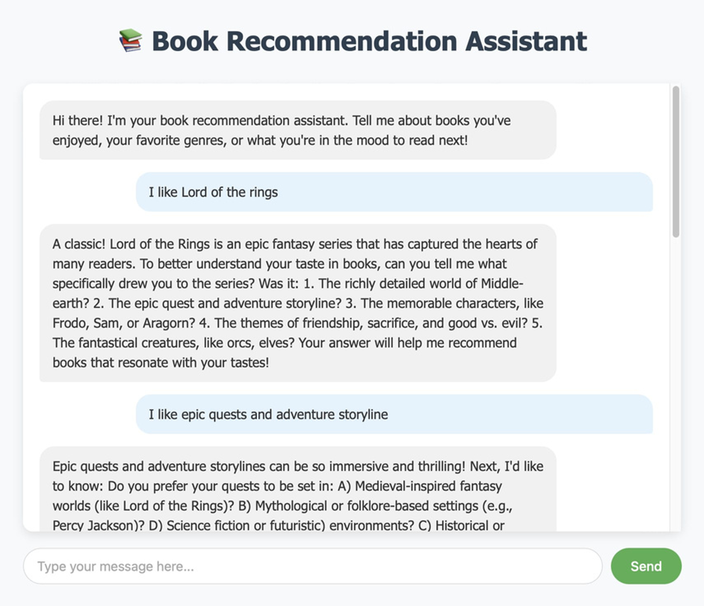
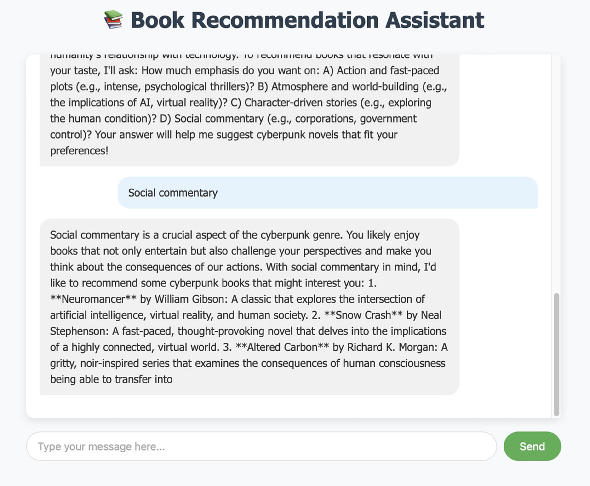

# Groq-based-AI-Book-Recommender-Chatbot

This project is an **AI-powered book recommendation web application** built with **Flask**, **Sentence-BERT**, and the **Groq API** (LLaMA 3).  
The chatbot engages in a natural conversation to understand a user's reading preferences and then provides **personalized book recommendations** based on **semantic similarity** and **ratings**.

---

## Features

- **Conversational Book Recommender**:  
  The chatbot asks 3-5 follow-up questions to learn the user's reading preferences (favorite genres, authors, themes, etc.) before recommending books.
  
- **AI-Powered Recommendations**:  
  Uses `sentence-transformers` (SBERT) to generate **semantic embeddings** of books and user preferences.

- **Hybrid Scoring**:  
  Combines **content similarity (70%)** with **book ratings (30%)** for more accurate suggestions.

- **Groq API Integration**:  
  Utilizes **LLaMA 3 (70B)** through Groq's API for conversational responses and preference extraction.

- **Embeddings Caching**:  
  Book embeddings are generated once and cached (`book_embeddings.npy`) to speed up subsequent runs.

- **REST API Endpoints**:  
  - `/chat` – Handles user conversations with the AI.  
  - `/recommend` – Returns top book recommendations based on the conversation context.

---

## Tech Stack

- **Backend**: Flask (Python)
- **ML Model**: Sentence-BERT (`all-MiniLM-L6-v2`)
- **LLM API**: Groq LLaMA 3 (via REST API)
- **Database**: CSV-based book dataset (`books.csv`)
- **Frontend**: Jinja2 templates (e.g., `index.html`)
- **Other Tools**: NumPy, Pandas, Torch, Requests

---

## Project Structure

.
├── app.py # Main Flask application
├── books.csv # Dataset with book info (title, author, description, genres, rating)
├── book_embeddings.npy # Cached embeddings for fast recommendations
├── templates/
│ └── index.html # Main UI template
└── README.md # Project documentation


---

## Installation & Setup

### **1. Clone the Repository**
```bash
git clone https://github.com/your-username/book-recommendation-chatbot.git
cd book-recommendation-chatbot
```
2. Create a Virtual Environment
```
python -m venv venv
source venv/bin/activate   # On Windows: venv\Scripts\activate
```
3. Install Dependencies
```
pip install -r requirements.txt
```
    If requirements.txt is not available, install manually:
```
pip install flask pandas sentence-transformers torch numpy requests
```
4. Prepare the Dataset

Ensure books.csv exists with the following columns:

title, author, description, genres, rating

5. Set Your API Key

Set the Groq API key as an environment variable:
```
export GROQ_API_KEY="your_api_key_here"
```
(On Windows, use set instead of export)
6. Run the Application
```
python app.py
```
The app will be available at:
http://127.0.0.1:5000/
 API Endpoints
POST /chat

Handles the conversation with the AI.

    Request:

    {
      "message": "I love sci-fi books!",
      "conversation": []
    }

Response:

    {
      "reply": "Which authors or books have you enjoyed recently?",
      "should_recommend": false
    }

POST /recommend

Generates book recommendations based on conversation history.

    Response:

    {
      "preferences": "The user likes highly-rated sci-fi books with dystopian themes.",
      "recommendations": [
        {
          "title": "Dune",
          "author": "Frank Herbert",
          "genres": "Sci-Fi, Adventure",
          "rating": 4.8,
          "description": "A classic space opera..."
        }
      ]
    }
---

## UI Preview





---

## License
This project is licensed under the MIT License.

---
